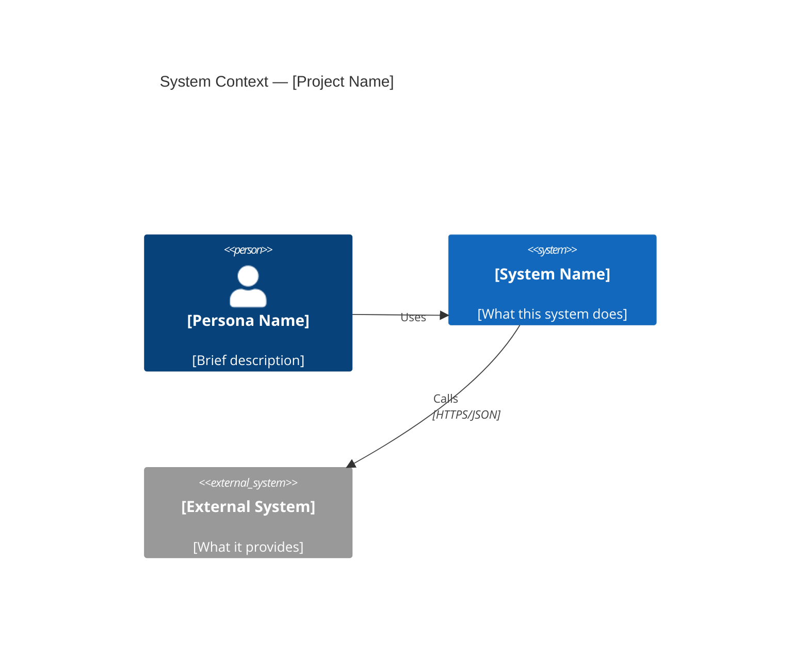
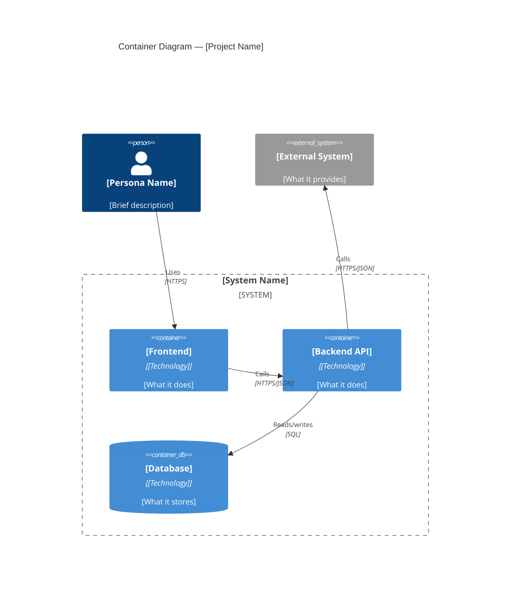
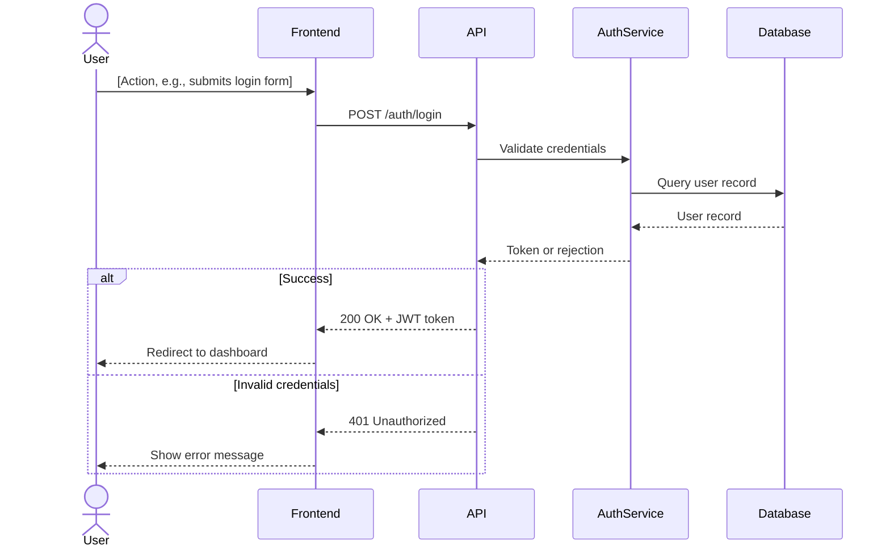
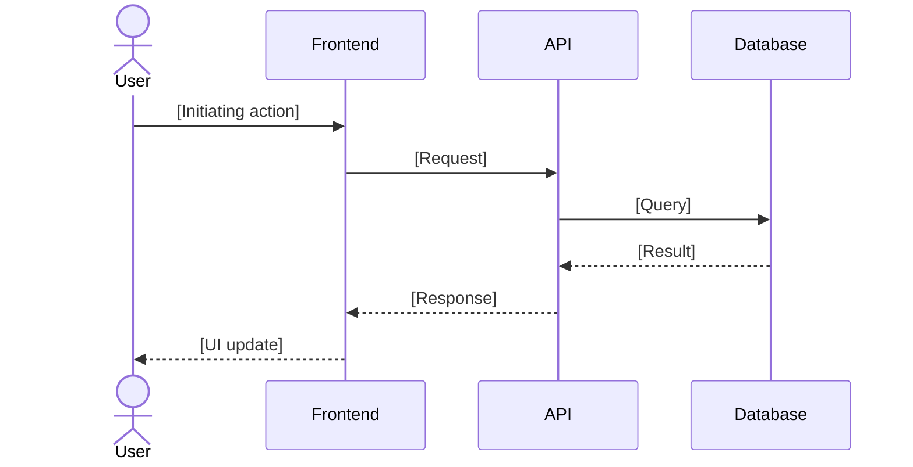

# Architecture Diagrams — [Project Name]

> Generated by `@arch-visualizer` from BMAD architecture docs.
> Source: `docs/architecture.md`, `docs/system-design.md`
> Last updated: [date]

---

## C4 Level 1 — System Context

> Shows the software system in the context of its users and external systems.
> Each element is a person or system — no implementation details at this level.

[Brief description of what this diagram shows and any important context or decisions]

---

## C4 Level 2 — Container Diagram

> Shows the containers that make up the system and how they communicate.
> Technology tags on each container help developers understand the stack.

[Brief description of architectural decisions visible in this diagram]

---

## Sequence Diagrams

### [Flow Name 1] — [e.g., Authentication Flow]

> [One sentence describing this flow and why it was prioritized]

---

### [Flow Name 2] — [e.g., Primary Feature Flow]

> [One sentence describing this flow]

---

## Open Questions / TODOs

<!-- Items flagged during diagram generation that need clarification from the architect -->

- [ ] <!-- TODO: example — clarify with architect -->
